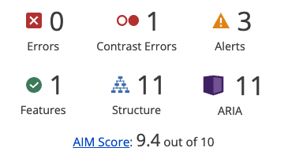
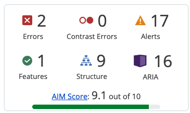
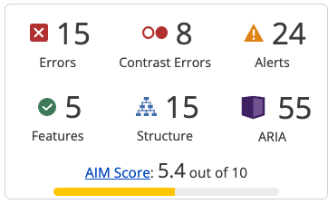

# résultats des tests d'accessibilité

## tests 20260528
tests réalisés avec l'extension Wave sur chrome.

- landing page => 9,4 / 10

- projects => 9,1 / 10

- project => 5,4 / 10

### analyse
Le composant participant est princalement responsable de la note basse du projet car pas de data et on peut améliorer le contraste (label / placeholder). Les autres problèmes sont souvnent liés à des éléments dynamiques (ex: les boutons d'actions) qui ne sont pas encore implémentés :)
Pour le moment pas d'action particulière à envisager. Au moment de dynamiser les composants, on pourra revoir les éléments qui posent problème et les améliorer.

## Mobile first

Après analyse et recherche, l’implémentation mobile-first avec Tailwind est correcte. Nous partons bien du principe que l’affichage par défaut correspond au mobile : certains éléments sont donc masqués afin de préserver la lisibilité sur petit écran. Ensuite, au fur et à mesure que la taille de l’écran augmente (sm, md, lg), des informations supplémentaires sont progressivement réaffichées grâce aux breakpoints responsive.

=> page de référence : https://tailwindcss.com/docs/responsive-design#mobile-first-breakpoints

### analyse
ras

## test de navigation au clavier
les tests suivant ont été réalisés sur les pages du site. Tout semble foncionnel.

test de navigation au clavier :
* avec Tab
* Shift + Tab
* Entrée
* Espace
* Échap pour fermer les modales

À vérifier :
* les boutons sont atteignables ;
* l’ordre de tabulation est logique ;
* le focus est visible ;
* quand une modale se ferme, le focus revient au bouton d’ouverture.

### analyse
ras, les test seront à refaire une fois que les pages (notamment les onglets) seront dynamiques et que les modales seront définitivement implémentées.

